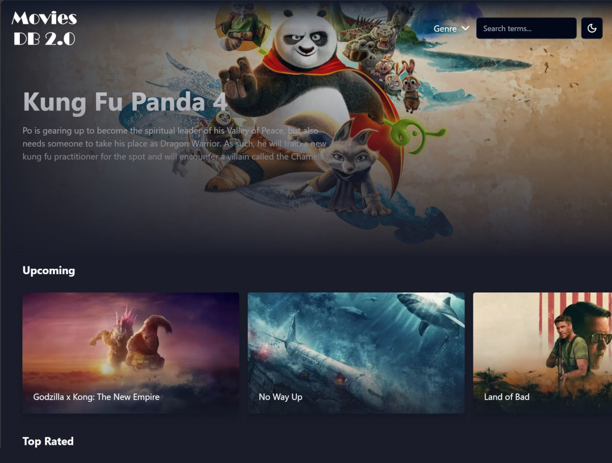

Movies Database V2 app
Movies Database app that lists the latest upcoming, top rated, and popular movies with a UI similar to Netflix or Disney+ but with its original touch. The movie posters, thumbnails, and descriptions are dynamically retrieved from TMDB through its [API](https://www.themoviedb.org/documentation/api) and Vercel's [SWR react hooks for data fetching](https://swr.vercel.app/).

Try it out: [https://movies-db2.web.app/](https://moviesdb2-react.vercel.app/)

## Screenshots:
<div align="center">
  
</div>

## Features.
- Carousel Banner at the top of the main page that displays the upcoming movies and loops automatically.
- Three Horizontal Carousels that list the upcoming, top-rated, and popular movies.
- Users can switch between Dark & Light themes. Default the system's theme.
- Option to list the movies from a particular genre which is selected from a list of available genres such as action, adventure, etc.
- Basic search functionality. The results of the search are cached for 24 hours taking advantage of [Nextjs's revalidating and caching functionality](https://nextjs.org/docs/app/building-your-application/data-fetching/fetching-caching-and-revalidating).

## Technologies

This is a [Next.js](https://nextjs.org/) project bootstrapped with [`create-next-app`](https://github.com/vercel/next.js/tree/canary/packages/create-next-app) template as well as the following components, services & dependencies:
- [TailwindCSS](https://tailwindcss.com/), the best utility-first CSS framework.
- [TMDB API](https://www.themoviedb.org/documentation/api) to retrieve the movies list and thumbnails.
- [SWR](https://github.com/axios/axios) react hooks for data fetching.
- [Embla Carousel](https://www.embla-carousel.com/get-started/react/) for React.
- [ShaCDN/UI](https://ui.shadcn.com/) react component library: Button, Dark mode theme, Dropdown menu, Input.
- [Vercel](https://vercel.com), to deploy the app.
- Optionally (but not functional at the moment because the OpenAI free account is expired), there is a module implemented with Azure functions and OpenAI's ChatGPT to get AI suggestions based on the search terms the user enters in the input component.

## Disclaimer

This is a personal project app with the main purpose of demonstrating the React.js capabilities with Nextjs features. This product uses the TMDB API but is not endorsed or certified by TMDB. Movie billboards and movie descriptions are retrieved directly using the free TMDB API.

## Getting Started

First, run the development server:

```bash
npm run dev
# or
yarn dev
# or
pnpm dev
# or
bun dev
```

Open [http://localhost:3000](http://localhost:3000) with your browser to see the result.

You can start editing the page by modifying `app/page.tsx`. The page auto-updates as you edit the file.

This project uses [`next/font`](https://nextjs.org/docs/basic-features/font-optimization) to automatically optimize and load Inter, a custom Google Font.

## Learn More

To learn more about Next.js, take a look at the following resources:

- [Next.js Documentation](https://nextjs.org/docs) - learn about Next.js features and API.
- [Learn Next.js](https://nextjs.org/learn) - an interactive Next.js tutorial.

You can check out [the Next.js GitHub repository](https://github.com/vercel/next.js/) - your feedback and contributions are welcome!

## Deploy on Vercel

The easiest way to deploy your Next.js app is to use the [Vercel Platform](https://vercel.com/new?utm_medium=default-template&filter=next.js&utm_source=create-next-app&utm_campaign=create-next-app-readme) from the creators of Next.js.

Check out our [Next.js deployment documentation](https://nextjs.org/docs/deployment) for more details.
